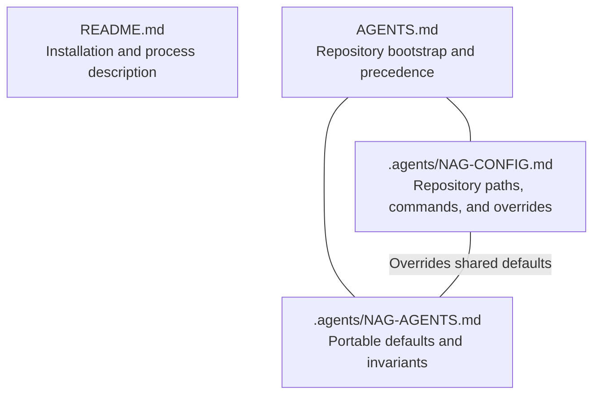
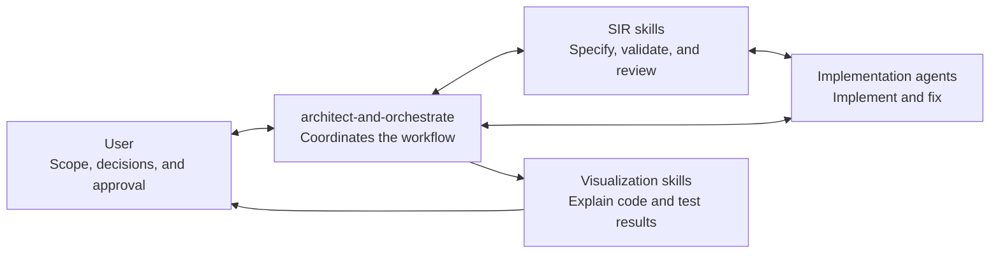

# NAG Design Overview

NAG (Neural Context Agent Gating) provides a reusable, agent-based software
development workflow that keeps developers in control of scope and important
decisions. Its goal is to produce correct, maintainable, self-documenting code
through explicit specifications, delegated implementation, deterministic
validation, and independent review.

## Important Design Principles:
1. Code is the primary source of documentation.
2. Deterministic checks and metrics provide guardrails for all agent-based development.
3. Orchestrate iterative development between higher-tier architect/orchestrator models and lower-tier implementation models with deterministic gates between iterations.
4. Use high-level visualizations for developer review.

## Reusability

NAG separates portable workflow guidance from repository-owned configuration.
Shared defaults and safety invariants remain consistent across projects, while
each repository supplies its own commands, paths, infrastructure policies, and
skill applicability. Versioned specifications and reviews make iteration
traceable, and concise visualizations help developers understand the resulting
code and test evidence without making generated artifacts authoritative.
- README.md and $update-agent-guidance help bootstrap a new repository
- $create-spec and $architect-and-orchestrate help you design, implement, test, and review.

## Guidance and configuration

## Skill orchestration

